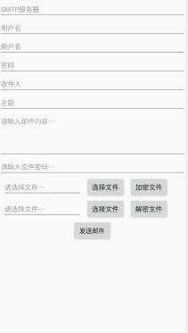
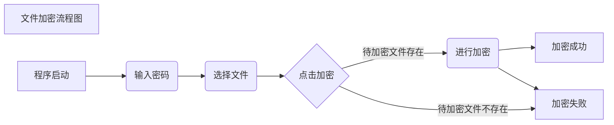
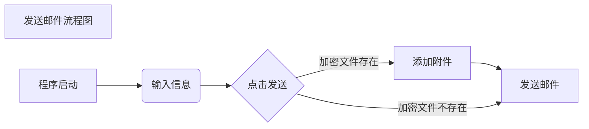

# 基于Android的带加密功能的邮件系统

## 1.程序需求

1.发送邮件

2.文件进行DES加密解密

3.计算文件MD5

## 2.程序结构

主要的代码逻辑部分有以下三个文件

ContentUriUtil.kt：用来把选择文件Intent返回的路径转换为真实路径

DesUtils.kt：用来进行文件的DES加密解密操作
MainActivity.kt：用来与界面进行交互的主要部分

还有就是界面布局文件

activity_main.xml：用来进行布局规划和设计



## 3.程序流程





## 4.开发中遇到的一些小问题

### 4.1 FileNotFoundException (permission denied) when trying to write file to sdcard in Android

 Google在 Android 6.0 开始引入了权限申请机制，将所有权限分成了正常权限和危险权限。应用的相关功能每次在使用危险权限时需要动态的申请并得到用户的授权才能使用。 （参考：https://developer.android.com/training/permissions/requesting.html）

系统权限分为两类：**正常权限和危险权限。**

-  **正常权限**不会直接给用户隐私权带来风险。如果您的应用在其清单中列出了正常权限，系统将自动授予该权限。
-  **危险权限**会授予应用访问用户机密数据的权限。如果您的应用在其清单中列出了正常权限，系统将自动授予该权限。如果您列出了危险权限，则用户必须明确批准您的应用使用这些权限。

简单来说就是在Android6.0以上的系统，文件在非本应用的位置写入文件需要得到用户授权，为了保证对之前版本的支持还需要进行适配。

为了解决这个问题，我们需要在运行时向用户申请权限，具体需要用到的Android API如下：

**ContextCompat.checkSelfPermission**
 检查应用是否具有某个危险权限。如果应用具有此权限，方法将返回 PackageManager.PERMISSION_GRANTED，并且应用可以继续操作。如果应用不具有此权限，方法将返回 PackageManager.PERMISSION_DENIED，且应用必须明确向用户要求权限。

**ActivityCompat.requestPermissions**
 应用可以通过这个方法动态申请权限，调用后会弹出一个对话框提示用户授权所申请的权限。

**ActivityCompat.shouldShowRequestPermissionRationale**
 如果应用之前请求过此权限但用户拒绝了请求，此方法将返回 true。如果用户在过去拒绝了权限请求，并在权限请求系统对话框中选择了 Don't ask again 选项，此方法将返回 false。如果设备规范禁止应用具有该权限，此方法也会返回 false。

**onRequestPermissionsResult**
 当应用请求权限时，系统将向用户显示一个对话框。当用户响应时，系统将调用应用的 onRequestPermissionsResult() 方法，向其传递用户响应，处理对应的场景。


在我们这个场景中的具体解决方案如下：

在AndroidManifest.xml中添加以下内容：

```xml
<uses-permission android:name="android.permission.WRITE_EXTERNAL_STORAGE" />
<uses-permission android:name="android.permission.READ_EXTERNAL_STORAGE" />
```

在MainActivity.kt中添加以下内容：

```kotlin
if (Build.VERSION.SDK_INT > Build.VERSION_CODES.LOLLIPOP) {
	if (ActivityCompat.checkSelfPermission(this, Manifest.permission.WRITE_EXTERNAL_STORAGE) != PackageManager.PERMISSION_GRANTED) {
		ActivityCompat.requestPermissions(this, PERMISSIONS_STORAGE, REQUEST_PERMISSION_CODE);
	}
}
```

### 4.2 界面显示不全

**情况及原因：**

由于在构建视图的时候使用的是LinearLayout，同时layout_height设置为wrap_content，在内容超出屏幕高度之后，就会发生显示不全的情况。

**解决方案：**

使用ScrollView代替LinearLayout最为最外层的框架，同时由于ScrollView的特性是里面只能有一个控件，我们还需要在所有的子元件外面套一个LinearLayout。

### 4.3 无法获取文件的真实路径

uri有多种类型的的scheme，例如content、file等，有些时候我们需要文件存储的真实路径例如Android混合开发中使用file与openFileChooser完成文件选择上传的功能，通过网友提供的工具类，可以根据"content://"类型或者其他类型的uri获取该文件的真实路径。

参考：https://blog.csdn.net/rickyfm/article/details/48448437

### 4.4 无法进行网络连接

主要是因为没有在AndroidManifest.xml进行网络权限申请导致的，我还检查了半天是不是手机网络的问题。。

只需要在其中加入以下内容就可以正常使用了：

```xml
<uses-permission android:name="android.permission.INTERNET" />
```

### 4.5 邮件中包含中文导致的乱码问题

参考：https://www.jianshu.com/p/d76a511a1dc2，把邮件的类型设置为MaildroidXType.HTML即可解决问题

## TODO

1. 现在在加密大文件的时候会导致UI Thread阻塞，后期考虑单独启动一个线程进行加密解密
2. 对异常的捕获不完全，有时候会导致程序崩溃
3. SMTP的信息现在还是需要进行手动填写，后期可以考虑预置一些常用的服务器，并提供高级设置的选项
4. 在API level 26 中，ProgressDialog被声明不赞成使用，应使用的替代方法是ProgressBar
5. 提供保存和加载配置的功能
6. 美化界面UI，考虑使用：腾讯开源的[QMUI](https://qmuiteam.com/android)进行界面美化
7. 提供收件箱功能
8. 自动解密收到的加密文件
9. 内容自动加密解密
10. 换个好看的图标

